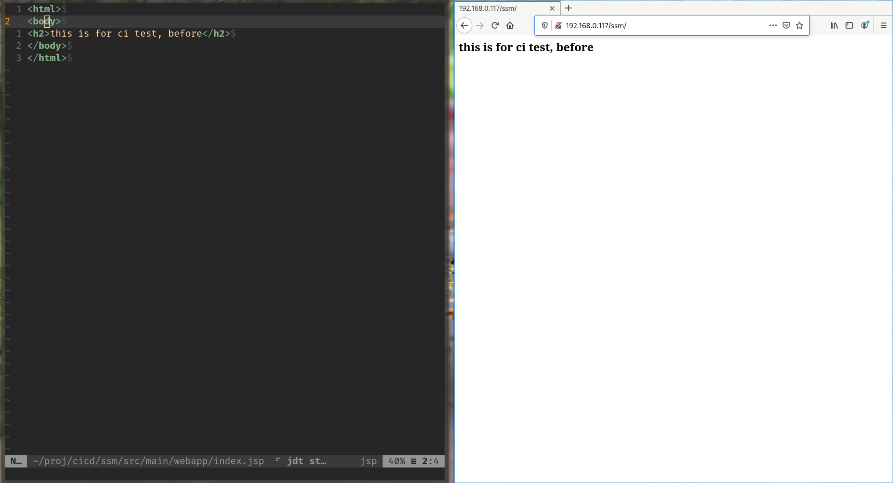
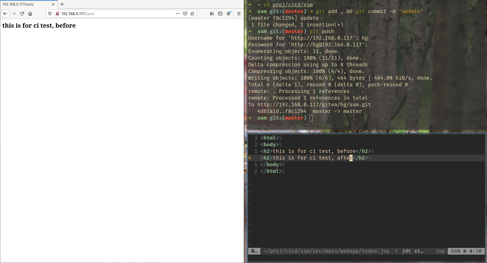
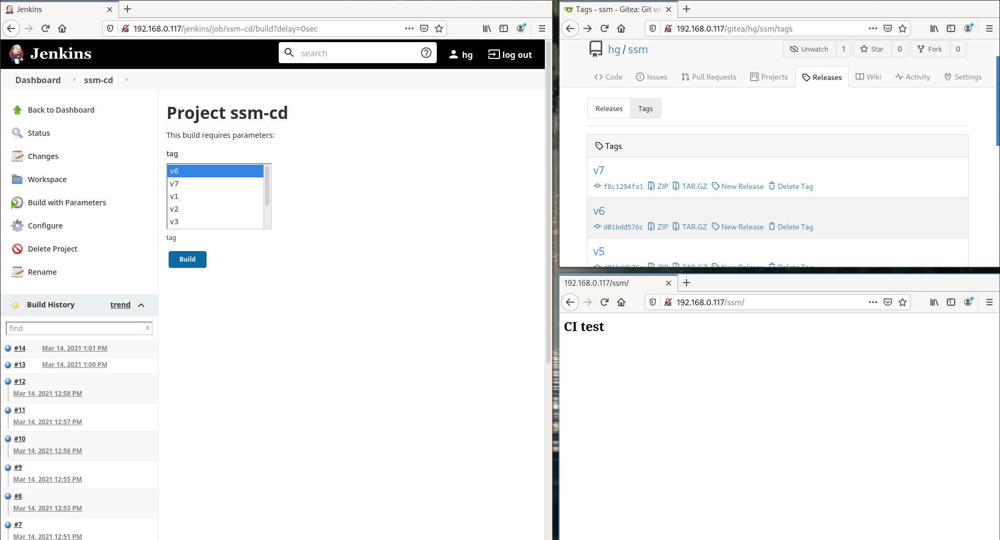
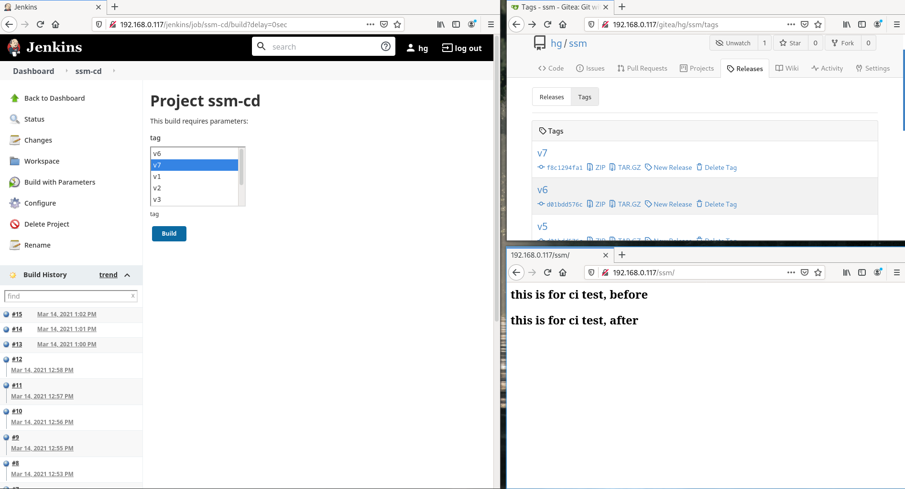

# 通过Docker搭建的基于版本管理的持续发布环境。

# 第一部分，搭建服务器
## 1 组成部分

- nginx

> 作为proxy服务器，作用为将各个服务用一个IP，通过sub url管理。

- gitea

> Go语言编写的轻量级Git版本服务器。

- jenkins

> 自动化服务器，Java编写，可用于CI（持续集成），CD（持续发布）。

- tomcat

> war文件目标发布服务器。

- ssm

> java工程源代码

## 2 启动nginx

```yml
#Docker配置文件
version: '3.7'
services:
  nginx:
    image: nginx
    ports:
      - 80:80
    volumes:
      - ./nginx.conf:/etc/nginx/nginx.conf:ro #使用当前文件夹下的配置文件
```

```
# nginx.conf
worker_processes  1;
events {
    worker_connections  1024;
}
http {
    include       mime.types;
    default_type  application/octet-stream;
    sendfile        on;
    keepalive_timeout  65;
    server {
        listen       80;
        server_name  localhost;

        location / {
            root   /usr/share/nginx/html;
            index  index.html index.htm;
        }

        # 服务中转
        location /gitea/ {
            proxy_pass "http://192.168.0.117:3000/";
        }
        location /jenkins/ {
            proxy_pass "http://192.168.0.117:9002/jenkins/";
        }
        location /ssm/ {
            proxy_pass "http://192.168.0.117:9003/ssm/";
        }
        error_page   500 502 503 504  /50x.html;
        location = /50x.html {
            root   /usr/share/nginx/html;
        }
    }
}
```

## 3 gitea启动

```yml
version: "3"

networks:
  gitea:
    external: false

services:
  server:
    image: gitea/gitea
    container_name: gitea
    environment:
      - USER_UID=1000
      - USER_GID=1000
      - DB_TYPE=mysql
      - DB_HOST=db:3306
      - DB_NAME=gitea
      - DB_USER=gitea
      - DB_PASSWD=gitea
    restart: always
    networks:
      - gitea
    volumes:
      - ./gitea:/data
      - /etc/timezone:/etc/timezone:ro
      - /etc/localtime:/etc/localtime:ro
    ports:
       - "3000:3000"    #映射3000端口，之前映射到9001端口出现找不到服务的问题。
       - "60022:22"     #映射SSH到60022端口，因为22的端口已经被主机占用，需要修改。
    depends_on:
      - db

  db:
    image: mysql:5.7
    restart: always
    environment:
      - MYSQL_ROOT_PASSWORD=gitea
      - MYSQL_USER=gitea
      - MYSQL_PASSWORD=gitea
      - MYSQL_DATABASE=gitea
    networks:
      - gitea
    volumes:
      - ./mysql:/var/lib/mysql
```

## 4 jenkins启动

```yml
version: '3.7'
services:
  jenkins:
    image: jenkins/jenkins:lts
    privileged: true
    user: root
    ports:
      - 9002:8080           #映射外部网络端口
      - 50002:50000         #jenkins内部服务用端口
    container_name: my-jenkins
    environment:
      - JENKINS_OPTS="--prefix=/jenkins"   #设置jenkins的sub url路径
    volumes:
      - ./data:/var/jenkins_home    #映射jenkins数据到当前目录下的data文件
      - ./docker.sock:/var/run/docker.sock
```

## 5 tomcat服务器启动

```yml

version: '3.7'
services:
  tomcat:
    image: tomcat:jdk8-adoptopenjdk-hotspot
    ports:
      - 9003:8080                  #映射端口
    container_name: my-tomcat
    volumes:
      - ./data:/usr/local/tomcat/webapps    #映射数据
```

# 第二部分，配置源代码和CICD

## 6 创建ssm工程并提交

```sh
mvn archetype:generate -DgroupId=com.hugang -DartifactId=ssm -DarchetypeArtifactId=maven-archetype-webapp -DinteractiveMode=false
```

## 7 jenkins配置CI

- 配置Java

- 配置Maven

- 配置插件（Publish over ssh)

- 配置Git

- 配置Triggers (Trigger builds remotely)

- 配置Build和Post-build Action

- 配置Gitea的Webhook
  http://hg:hg@192.168.0.117/jenkins/job/ssm-ci/build?token=111818430cfe05c9eef6c8c1309606b3af GET


## 8 jenkins配置CD

- 配置插件（Git Parameter, Publish over ssh)

- 配置Git (使用Tag)

- 配置Build和Post Build

## 效果图

<table>
<tr><td></td><td></td></tr>
<tr><td></td><td></td></tr>
<tr><td></td><td></td></tr>
</table>
