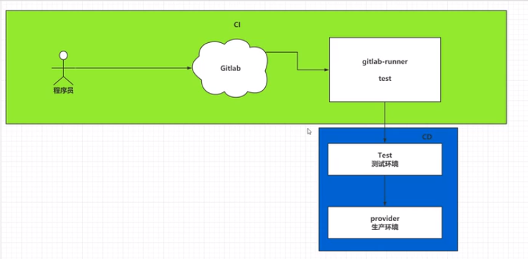

# Docker


## 一 Docker介绍

### 1.1 引言

> 1 我本地运行没问题啊。
>
>     环境不一致。
>
> 2 哪个哥们又写死循环了，怎么这么卡
>
>     在多用户的操作系统下，会相互影响
>
> 3 用户量激增。
>
>     运维成本过高的问题。
>
> 4  学习一门技术，学习安装成本过高。
>
>     docker可以快速安装。

### 1.2 Docker的由来

> 一帮年轻人创业，2010年专门做PAAS平台。
>
> 到了2013年的时候，像亚马逊，微软，Google都开始做PAAS平台。
>
> 2013年，公司将核心技术开源，这个核心技术就是Docker。
>
> 2014年，获得C轮融资$40M
>
> 2015年，获得D轮融资$50M
>
> 全力维护Docker，主要作者之一：所罗门 Solomon Hykes


> 2018年，所罗门离开Docker


### 1.4 Docker的思想

> 1 集装箱
>
>     会将所有需要的内容放到不同的集装箱中，谁需要这些环境直接拿到这个集装箱就可以了
>
> 2 标准化
>
>     -运输的标准化： Docker有一个码头（Docker Hub），所有上传的集装箱都放到这个码头上，当谁需要莫一个环境，就直接指派大鲸鱼搬运这个集装箱就可以了。
>
>     -命令的标准化： Docker提供了一系列的命令，帮助我们去获取集装箱等等操作。
>
>     -提供了REST的API： 衍生出了很多的图形化界面，Rancher。
>
> 3 隔离性
>
>     Docker在运行集装箱的内容时，会在Linux的内核中，单独开辟一片空间，这片空间不会影响到其他程序。
>     - 注册中心。（超级码头，上面放的就是集装箱）
>     - 镜像。（集装箱）
>     - 容器。（运行起来的镜像）


## 二 Docker的基本操作

### 2.1 安装Docker

```sh
# 1.下载Docker安装的依赖
dnf config-manager --add-repo https://download.docker.com/linux/centos/docker-ce.repo
dnf -y install docker-ce docker-ce-cli containerd.io
```

```sh
# 设置自动启动
systemctl enable docker
# 启动docker
systemctl start docker
```

2.2 Docker中央仓库

> 1. Docker官网的中央仓库
>
> 2. 镜像网站
>
> 3. 私有服务器
>
>    需要添加配置 /etc/docker/daemon.json


### 2.3 镜像的操作

```sh
# 1.拉取镜像到本地
docker pull 镜像名称[:tag]
# 举个栗子
docker pull tomcat:8.5.63-jdk8-corretto
```

```sh
# 2.查看全部镜像
docker images
```

```sh
# 3.删除本地镜像
docker rmi 镜像标识
```

```sh
# 4.镜像的导入导出
# 将本地镜像导出
docker save -o ./tomcat.image 镜像标识
# 导入本地镜像
docker load -i ./tomcat.image
```

```sh
# 5.修改镜像名称
docker tag 镜像标识 新镜像名称：版本
```

### 2.4 容器的操作

```sh
# 1.运行容器
docker run 镜像标识|镜像名称[:tag]
# 常用参数
docker -run -d -p 宿主机端口:容器端口 --name 容器名称 镜像标识|镜像名称[:tag]
# -d 后台启动
# -p 端口映射关系
# --name 容器名称
```

```sh
# 2.查看容器
docker ps [-qa]
```

```sh
# 3.查看容器日志
doccker logs -f 容器名称|容器标识
```

```sh
# 4.进入容器
docker exec -it 容器名称|容器标识 命令
```

```sh
# 5.停止容器
docker stop 容器名称|容器标识
# 删除容器
docker rm 容器名称|容器标识
# 启动容器
docker start 容器名称|容器标识
```


## 三 Docker应用

### 3.1 准备war

```dockerfile
mvn clean package
```

### 3.2 准备数据库

```sh
# 运行mysql数据库
docker run -d -p 3306:3306 --name mysql -e MYSQL_ROOT_PASSWORD=password mysql:5.7.33
# 连接数据库执行初始化sql
```

### 3.3 启动Tomcat

```sh
# 启动tomcat
docker run -d -p 8080:8080 --name tomcat tomcat
# 将war包拷贝到tomcat的webapp下
docker cp target/ruoyi-admin.war tomcat:/usr/local/tomcat/webapps/
```

### 3.4 数据卷

> 为了部署SSM的工程，需要使用到cp命令将宿主机的war文件复制到容器内部。
>
> 数据卷：将宿主机的一个目录映射到容器的一个目录。
>
> 可以在宿主机中操作目录中的内容，那么容器内部映射的文件，也会跟着一起改变。

```sh
# 1.创建数据卷
docker volume create 数据卷名
# 数据卷创建完成后，会默认存放在一个目录下/var/lib/docker/volumes/数据卷名/_data

# 2.查看数据卷
docker volume ls
docker volume inspect 数据卷名

# 3.删除数据卷
docker volume rm 数据卷名

# 4.应用数据卷
docker run -v 数据卷名:目标路径 镜像名称|镜像标识
docker run -v 宿主机路径:目标路径 镜像名称|镜像标识
# 第二种方式不会将容器内部文件带出来

```


## 四 Docker自定义镜像

> 中央仓库的镜像文件，也是Docker的用户自己上传上去的。

```sh
#1 创建一个Dockerfile文件，并且制定自定义镜像信息。
#Dockerfile文件中常用的内容
# from: 指定当前自定义镜像依赖的环境
# copy: 将相对路径下的内容复制到自定义镜像中
# workidr: 声明镜像的默认工作目录
# cmd: 需要执行的命令（在workdir下执行，cmd可以写多个，但是只会执行最后一条）
```

```dockerfile
from tomcat:v1
copy my.war /usr/local/tomcat/webapps
```

```sh
# 制作镜像
docker build -t 镜像名称[:tag] .
```


## 五 Docker-Compose

> 之前运行一个镜像，需要添加大量的参数。
>
> 可以通过Docker-compose编写这些参数，批量管理容器。

### 5.1 安装docker-compose

```sh
# 下载docker-compose
sudo curl -L "https://github.com/docker/compose/releases/download/1.28.5/docker-compose-$(uname -s)-$(uname -m)" -o /usr/local/bin/docker-compose
# 赋予执行权限
sudo chmod +x /usr/local/bin/docker-compose
```

### 5.2 Docker-compose管理多个容器

```yaml
version: "3"

networks:
  gitea:
    external: false

services:
  server:
    image: gitea/gitea:1.13.3
    container_name: gitea
    environment:
      - USER_UID=1000
      - USER_GID=1000
      - DB_TYPE=mysql
      - DB_HOST=db:3306
      - DB_NAME=gitea
      - DB_USER=gitea
      - DB_PASSWD=gitea
    restart: always
    networks:
      - gitea
    volumes:
      - ./gitea:/data
      - /etc/timezone:/etc/timezone:ro
      - /etc/localtime:/etc/localtime:ro
     ports:
       - "3000:3000"
       - "222:22"
     depends_on:
       - db
 
   db:
     image: mysql:5.7
     restart: always
     environment:
       - MYSQL_ROOT_PASSWORD=gitea
       - MYSQL_USER=gitea
       - MYSQL_PASSWORD=gitea
       - MYSQL_DATABASE=gitea
     networks:
       - gitea
     volumes:
       - ./mysql:/var/lib/mysql
```

### 5.3 使用docker-compose命令管理容器

> 在使用docker-compose命令时，默认会在当前目录下找docker-compose.yml文件。

```sh
# 初始化启动
docker-compose up -d
# 销毁容器
docker-compose down
# 开启|重启|停止
docker-compose start|restart|stop
# 查看
docker-compose ps
```

### 5.4 docker-compose配置dockerfile使用

> 使用docker-compose.yml文件以及Dockerfile文件在生成自定义镜像的同时启动当前镜像，并且由docker-compose去管理容器。

```yaml
version "3.1"
services:
  ssm:
    restart: always
    build:
      context: ./             #dockerfile所在目录
      dockerfile: Dockerfile    #dockerfile文件名称
    image: ssm:1.0            #自定义镜像名称
    container_name: ssm       #容器名
...
```

> 如果自定义镜像不存在，会帮助我们构建自定义镜像，如果存在直接使用
>
> 或者通过 docker-compose build / docker-compose up -d --build


## 六 Docker的CI CD

### 6.1 引言

> 项目部署
>
> 1. 将项目编译打包
> 2. 将文件上传到指定的服务器中
> 3. 通过dockerfile将tomcat和war包制作成一个镜像
> 4. 重新启动docker容器
>
> 项目更新后
>
>   将重复执行上述流程

### 6.2 CI介绍

> CI (Continuous Intergration) 持续集成
>
> 持续集成：编写代码时，完成了一个功能后，立即提交到Git仓库中，将项目重新的构建并且测试。
>
> - 快速发现错误。
> - 防止代码偏离主分支。

### 6.3 实现持续集成

> Gitlab + Gitlab runner
>
> Gitea + Jenkins

### 6.4 实现持续部署




> Jenkins : Git parameters + publish + Persistent Parameter
